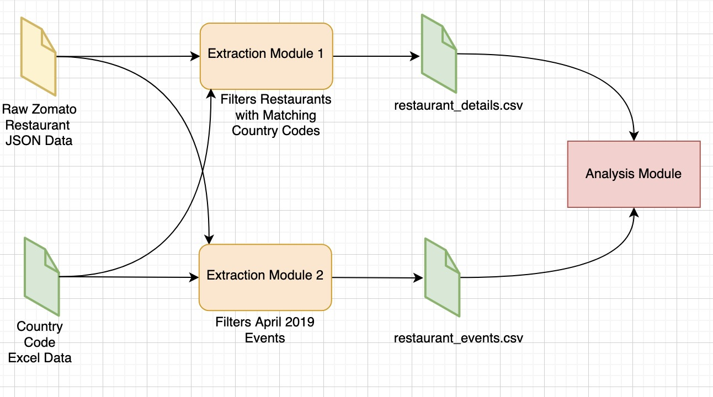

# career-coach-tha | Hsu Stanley

## Setup Guide

1. Download `tha_stan.zip` from this repo and extract its contents.
2. If you have Python installed, proceed to **Step 4**.
3. If you **do not** have Python installed, follow the instructions below:

### **For Mac Users**:

- **a.** Check if Python 3 is installed by opening **Terminal** and running:
  ```sh
  python3 --version
  ```
  - If Python is installed, you will see output similar to:
    ```
    Python 3.x.x
    ```
- **b.** If Python is **not installed**, install it using:
  ```sh
  brew install python
  ```

### **For Windows Users**:

- **a.** Download the latest **Stable Release** from **[python.org](https://www.python.org/downloads/windows/)**.
- **b.** Run the installer and **check the box** `"Add Python to PATH"` before clicking **Install**.
- **c.** Verify your installation by opening **Command Prompt** and running:
  ```sh
  python --version
  ```
  - If Python is installed, you will see output similar to:
    ```
    Python 3.x.x
    ```

4. Once Python is installed, open **Terminal** (Mac) or **Command Prompt** (Windows) and navigate to the location of the extracted `tha_stan` folder using:

   ```sh
   cd "replace with path to tha_stan folder"

   ```

5. Install Dependencies using

```sh
pip install -r requirements.txt
```

## Case Study Scenario 1

### **Architecture Diagram**


