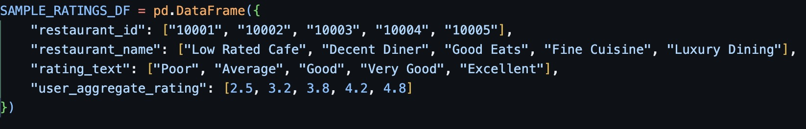

# career-coach-tha | Hsu Stanley

## Setup Guide

1. Download `tha_stan.zip` from this repo and extract its contents.
2. If you have Python installed, proceed to **Step 4**.
3. If you **do not** have Python installed, follow the instructions below:

**For Mac Users**:

- **a.** Check if Python 3 is installed by opening **Terminal** and running:
  ```sh
  python3 --version
  ```
  - If Python is installed, you will see output similar to:
    ```
    Python 3.x.x
    ```
- **b.** If Python is **not installed**, install it using:
  ```sh
  brew install python
  ```

**For Windows Users**:

- **a.** Download the latest **Stable Release** from **[python.org](https://www.python.org/downloads/windows/)**.
- **b.** Run the installer and **check the box** `"Add Python to PATH"` before clicking **Install**.
- **c.** Verify your installation by opening **Command Prompt** and running:
  ```sh
  python --version
  ```
  - If Python is installed, you will see output similar to:
    ```
    Python 3.x.x
    ```

4. Once Python is installed, open **Terminal** (Mac) or **Command Prompt** (Windows) and navigate to the location of the extracted `tha_stan` folder using:

   ```sh
   cd "replace with path to tha_stan folder"

   ```

5. Create a new virtual environment for this project using:

```sh
python3 -m venv venv
```

6. Activate the virtual environment.

For Mac Users

```sh
source venv/bin/activate
```

For Windows Users

```sh
venv\Scripts\activate
```

7. Install Dependencies using

```sh
pip install -r requirements.txt
```

## Case Study Scenario 1

### Running Scenario 1 Application

Please ensure you are in the tha_stan directory in command shell or Terminal. Navigate to the scenario_1 directory using the following command:

```sh
cd scenario_1
```

Once Python, virtual environment and dependencies have been set up, run the app using the following command:

```sh
python main.py
```

This will complete each step required in the pipeline. Upon completion of the pipeline, you should see

```sh
Scenario 1 Pipeline Completed
```

To run individual modules, use the following command:

```sh
python (change module name).py
```

### **Architecture Diagram**


**Scenario 1's Architecture consists of 4 layers:**

1. Raw Data Layer

- Contains unprocessed Zomato Restaurant Data and Country Excel Data

2. Preprocessing Layer

- Contains Preprocessing Module that reads raw data and writes relevant data to csv file

3. Extraction and Data Manipulation Layer

- Extraction Module 1, Extraction Module 2 and Analysis Module extract and manipulate preprocessed data

4. Output Layer

- Contains files generated from extraction and data manipulation layer

**Why have a preprocessing module?**
Upon creating and using the "inspect_json" function (now found in preprocessing_module.py), it is evident that the JSON data structure is messy and difficult to parse.


**Preview of JSON Structure**

Therefore, for modularity, a preprocessing module was first created to parse the essential JSON data, then proceed with data manipulation, extraction and analysis in extraction module 1 and 2 and the analysis module.

Additional fields to be saved to the "preprocessing_csv" can be included accordingly by editing the "json_to_restaurant_details_csv" function in the preprocessing module.

Duplicate restaurants and events are dropped here, with restaurants requiring an exact match to be dropped since it is possible a restaurant changes cuisine or location over time. For events, only the restaurant id, event name and event date need to match for it to be considered a duplicate entry.


**Conditions for Events to be considered Duplicate**

### **Potential Architecture Diagram with Cloud Services Integrated**


The Updated Architecture with Cloud Services now consists of 5 layers:

1. Raw Data Layer
2. Preprocessing Layer
3. Data Storage/Warehousing Layer (new)
4. Extraction and Data Manipulation Layer
5. Output/Visualization Layer

Assuming the volume and frequency of Data to be ingested and processed is significantly higher, integrating Cloud Services cans make our application highly scalable, available and maintainable.

With cloud services integrated, the **Raw Data** is now stored in a Data Lake, Amazon S3 first. This allows for data from multiple sources and formats to be scalably stored. S3 can be configured to allow for faster but more costly on demand retrieval, if the raw data has to be constantly read from, or configured to be slower access but lower in cost, for archival/large batch processing purposes.

The **Preprocessing Layer** now uses Amazon Glue Crawler to automatically crawl the S3 bucket(s), extract the schema of the raw data and store data into an AWS Glue Data Catalogue. The crawled data can also be converted to more memory efficient formats like Parquet.

In addition, Amazon Glue ETL Jobs can help do initial transformations and mappings for restaurant and event data. These Glue Jobs can be configured to automatically process the data conditionally (like when new raw data is uploaded to S3) for stream processing or processed as a batch less frequently (end of the week/month etc). Apache Airflow DAGs can also be implemented for scheduled Glue Job execution.

There is a new **Data Storage/Warehousing Layer** where preprocessed data is stored in a Data Warehouse. Since we are dealing with tabular data, Amazon Redshift can be utilised as it is buil for columnar storage. The Redshift Data Warehouse allows for efficient data retrieval for manipulation and analysis, with a standardized schema enforced for the preprocessed data.

For the **Extraction and Data Manipulation** layer, since the volume of data is large, instead of using Pandas/Python, Amazon Athena can be used to make efficient SQL queries and extract data from the Data Warehouse, which can then be visualized/analyzed in Amazon Quicksight (**Output Layer**). Big Data frameworks like Apache Spark can also be used for Data Manipulation instead.

### Scenario 1 Task 1

- Preprocessed restaurant data from the preprocessing module is utilised as the data source.
- "extraction_module_1.py" consists of a "load_country_codes" function and "filter_restaurant_details" function
- The "load_country_codes" will take an excel path of country code mappings as input and output a dictionary of country code mappings.
- The "filter_restaurant_details" will make use of the "load_country_codes" function to take in a country code mapping and preprocessed restaurant data to output only restaurants that have a valid country code mapping.
  - Empty fields are populated with "NA".
- The output, "restaurant_details.csv" is stored in the output/task_1 folder.

### Scenario 1 Task 2

- Preprocessed event data from the preprocessing module is utilised as the data source.
- "extraction_module_2.py" consists of a "filter_events_by_date" function.
- The "filter_events_by_date" function takes in preprocessed event data, and a date range to filter events by.
  - It will output events that have fall within the given date range.
- To handle events with either a valid start or end date, but not both, the following logic was included.


**Logic to allow permutations of valid start and end date, valid start but invalid end date, valid end but invalid start date**

- For this task, the date range is set for dates that fall within April 2019.
- The output, "restaurant_events.csv" is stored in the output/task_2 folder.

### Scenario 1 Task 3

- Output data from task 1, "restaurant_details.csv" is used as the data source.
- "analysis_module.py" reads the restaurant details data, and inspects the unique rating_text values.
  - Since there are rating_texts that are not in English and restaurants that are not rated, the non English ratings would be mapped to either of the "Excellent, Very Good, Good, Average, Poor" categories and entries without ratings would be removed.


**Mapping Non English Text Ratings**

- The output, **"ratings_analysis.pdf" is stored in the output/task_3 folder.**

**The following 6 data visualizations were used to analyse and determine rating text thresholds. The insights from each visualization are also listed:**

1. groupby text rating category and describe() to provide summary statistics for the aggregate ratings

- This gave a high level view of the text rating categories. The counts of each category other than poor were sufficient.
- There seemed to be a clear segmentation of text rating by aggregate rating.

2. Histogram of aggregate ratings

- Most ratings seemed to fall within the 4.0 and 4.5 range, leading to a left skew distribution.
- This could indicate that users tend to leave positive reviews, or that restaurants included in the raw JSON tend to be more popular/well received.
- The high concentration of 4.0 and 4.5 ish ratings may lead to difficulties in segmenting Good, Very Good and Excellent Ratings.

3. Bar plot of counts of rating text categories

- There is a disproportionately high number of Very Good ratings compared to Poor, Average and Good ratings.
- Some of the Very Good ratings can likely be shifted to Good or Excellent

4. Scatterplot of mean aggregate rating by rating text

- There is a clear linear trend of the means increasing from Poor to Excellent.
- The means can serve as a relatively reliable reference point for thresholds.

5. Box plot of aggregate ratings by rating text

- Box plot whiskers give a clear visual segmentation of the range of non outliers for the Average to Excellent ratings.

6. Violin plot of ratings for each rating text

- Violin plots clearly indicate visually the rating range in which majority of rating text categories lie.
- Can decide aggregate rating threshold for rating text categories by evaluating aforementioned ranges together with box plot whisker ranges

**Task 3 Analysis Conclusions**

Based on the analysis conducted and primarily looking at the insights from visualization 5 and 6, the following rating text thresholds have been obtained:

- 0.0 <= Poor < 3.0
- 3.0 <= Average < 3.7
- 3.7 <= Good < 4.0
- 4.0 <= Very Good < 4.4
- 4.4 <= Excellent <= 5.0

## Case Study Scenario 2

### Running Scenario 2 Application

Please ensure you are in the tha_stan directory in command shell or Terminal. Navigate to the scenario_2 directory using the following command:

```sh
cd scenario_2
```

Once Python, virtual environment and dependencies have been set up, run the app using the following command:

```sh
python main.py
```

This will open the Scenario 2 **"Carpark Search System"** App. You should see the following:


You can begin querying for carpark by Carpark Number or Address.

### **Architecture Diagram**


**Scenario 2's Architecture consists of the following components:**

1. CSV Processing Module

- This module processes and cleans raw static carpark csv data

2. API Fetcher Module

- This module will fetch and preprocess Live Carpark API data

3. (Re)Merged Data Processing Module

- This module ingests, merges and cleans Live API Data and static processed carpark data
- **Subsequently, merged data will be used for new remerges so the most updated API information is obtained even if API cannot fetch information for some carparks**
- If some carpark data is missing in newly fetched API data, old rows without information updates are kept while rows with updated information are remerged

4. User Input Handling Module

- This module will take user input, and validate if it matches static carpark data first
  - If search is by address, it will be **fuzzily** matched instead of exact matched
- If the carpark number/address can be matched/fuzzily matched, it calls the API Fetcher Module (module 3) to fetch Live API Data, and then calls Merged Data Procesing Module (module 4) to reprocess the newly fetched Live API Data

5. CLI Module for both Input and Output

- This module contains the information to be displayed on the CLI
- User selection choices and input choices are determined here
- User can only use keyboard inputs and select options according to what is displayed on the CLI i.e "Enter '1' to query by Car Park Number"
- Invalid inputs will throw errors

More details for each of the modules will be provided below.

**Why use fuzzy matching for validation?**

The "fuzzywuzzy" package allows for fuzzy matching of user inputted data, and provides an approximate match score.

This allows for obviously incorrect addresses or carpark numbers, i.e a string of random gibberish "xcmvnenFFFds" to be filtered away.

Only matches that hit a certain match score i.e 85% match will be displayed, allowing graceful handling of user input errors.

**Why merge on already merged data instead of merging freshly fetched Live API data with static carpark data?**

As mentioned in the description for the (Re)Merged Data Processing Module (module 4), if some carpark data is missing in newly fetched API data, old rows without information updates are kept while rows with updated information are remerged.

This is so there will be minimal rows with no merged API data.

**Why only fetch Live API Data when input validated?**

This prevents excessive API calls that will slow down the application or unnecessarily add to the API retrieval rate limit.

### **Potential Architecture Diagram with Cloud Services Integrated**


The Updated Architecture with Cloud Services incorporates the following services:

1. Amazon API Gateway
2. AWS Lambda
3. Amazon DynamoDB

For Scenario 2, integrating cloud services assumes the need for a low-latency, highly available, and scalable solution, given the requirement to handle numerous simultaneous API requests in near real time.

When a user submits a request, it is first received by **Amazon API Gateway**, which validates, secures, and processes the request. API Gateway also prevents excessive API calls and ensures fair compute resource distribution across users.

The request is then forwarded to **AWS Lambda**, which extracts the query and sends a request to Amazon DynamoDB to fetch the latest carpark availability data. **Amazon DynamoDB** is optimized for near real time response, and can dynamically scale to handle fluctuating traffic loads, making it ideal for real time data retrieval. Since DynamoDB is a NoSQL key value database, it efficiently handles semi-structured JSON data, eliminating the need for complex join operations, thus reducing processing overhead.

Once the data is retrieved, AWS Lambda formats it into a structured JSON response and returns it to Amazon API Gateway, which then forwards the response to the user's device. This ensures the user receives up-to-date carpark availability information with minimal latency.

This cloud architecture provides scalability and high availability and ensures near real time retrieval of carpark availability queries.

### Scenario 2 Tasks 1,2 and 3

Since the 3 tasks have some overlap i.e task 1: handle data validation and cleaning, task 2: query/search by address (I want the search to be validated first before searching), the completion of Scenario 2 will instead be broken down into discussion of the respective modules.

**Module 1: static_carpark_processing_module.py (CSV Processing Module)**

- Reads raw static carpark data as input
- Consists of the "process_static_carpark_data" function that checks for missing values, drops duplicate entries
- The output is saved in the processed_data folder as "processed_static_carpark_data.csv"
- This module is **not called** in main.py as it assumes the static data will be updated very infrequently, so it is only processed once

**Module 2: carpark_api_fetcher_module.py (API Fetcher Module)**

- Consists of "fetch_capark_availability", "get_lot_types" and "save_carpark_api_data" function
- "fetch_capark_availability" attempts to fetch API data for carpark availability and allows for configuration of retries, delay and timeout
- "get_lot_types" is a helper function that obtains the list of lot types from fetched API carpark data dynamically
- "save_carpark_api_data" function takes in fetched API carpark data, extracts the relevant data, and writes it to a csv file stored under the preprocessed_data folder as "api_carpark_data.csv"


**As there could be multiple rows for same car_park_no but different lot_type, all lot_type data for the same car_park_no was included as a singular row**

**Module 3: merged_data_processing_module.py ((Re)Merged Data Processing Module)**

- Takes static carpark data and fetched and preprocessed Live API data as input
- Consists of "load_csv", "merge_initial" and "update_merged" functions
- "load_csv" is a generic helper function loads a csv file to a pandas dataframe. It will indicate if no data from the filepath is found.
- "merge_initial" will perform the initial merge of static carpark data with API data (if no previous merged file exists)
  - Uses a left join on car_park_no to ensure all static carparks are retained
  - null column entries are populated with "Data Not Available" instead of "NA" as it assumes it is simply the API not fetching the data for that specific carpark
  - Output is saved to processed_data folder as "processed_merged_data.csv"
- "updated_merged" function updates the existing merged dataset by incorporating new API data
  - **It will only update rows if the API data has a more recent timestamp**
  - Rationale for this is if for example, latest API call cannot fetch data for carpark x, **carpark x which has entry in old processed_merged_data.csv will retain original time and lot availability data instead of being overwritten with "Data Not Available"**
  - Output is also saved to processed_data folder as "processed_merged_data.csv"


**Logic for Updating Merged Rows based on Update Datetime**

**Module 4: user_input_handling_module.py (User Input Handling Module)**

- Takes processed static carpark data and processed merged data as input
- Consists of the "load_static_data", "validate_carpark_number", "fuzzy_match_address" and "handle_user_input" functions
- "load_static_data" is a helper function that loads a csv file to a pandas dataframe. It will indicate if no data from the filepath is found.
- "validate_carpark_number" is a helper function that validates if user inputted carpark number exists in static data and is case insensitive


**"validate_carpark_number" will standardize the user input capitalization first match**

- "fuzzy_match_address" uses the "fuzzywuzzy" module to assign a confidence score to each user inputted Address query, computed by comparing the input against the static carpark data Addresses
- **It will return the top 5 matches by confidence/match score if the user inputted address is not exact**
- The user can choose from the top 5 closest matches, or attempt to enter another search query/return to main menu.


**Logic for Fuzzy Matched Address Query Results**

- The "handle_user_input" function triggers appropriate modules and functions based on user input
- It dictates the user flow for the CLI app, and calls upon other modules and functions to fetch capark availability data based on the queries entered, i.e fetch Live API data if carpark number entered has exact match with static carpark data


**Snippet of User Flow Dictation**


**Snippet of Carpark API Being Called After Valid User Input**

**Module 5: cli_module.py (CLI Module for both Input and Output)**

- Lists the items to be displayed for the CLI before and after user input
- Consists of "display_results" and "display_menu" function
- "display_results" takes a pandas dataframe of queried results and displays details to the user


**Snippet for code determining how results are displayed**

- "display_menu" displays the main menu options to the user


**Menu Display code**

## Unit Testing

Apologies, the testing section is not very well flushed out due to time constraints!

### Scenario 1 Unit Testing

Unit tests have been written for the "preprocessing_module", "extraction_module_1" and "analysis_module", and can be found in the tests folder.

1. For "preprocessing_module", fake JSON data is created and the test file validates whether this data is retrieved properly by the "json_to_restaurant_details_csv" and "json_to_event_details_csv" function.


**Unit Test for Preprocessing Module**

2. For "extraction_module_1", fake restaurant data and country mapping data is created and the test file validates whether the data is properly extracted and processed by the "filter_restaurant_details" function.


**Unit Test for Extraction Module**

3. For "analysis_module", the test file validates if the restaurant data is properly processed and the plots are properly generated.
   **While the analysis_module works with larger datasets, it is found that when there are a lack of datapoints, i.e insufficient to get standard deviation or lacking ratings from certain rating_text categories, the current code will not plot the data.**

Due to time constraints, this issue not yet been addressed.


**Sparse Analysis Test Data that leads to Unit Test Error**


**No standard deviation so could not plot data visualizations**

To run the unit tests, ensure you are in the scenario_1 directory. Use the command

```sh
pytest tests/
```

You should see that the tests are run and passed for the preprocessing and extraction module 1, but fails for the analysis module.


**Unit tests running for preprocessing, extraction module 1 and analysis module**

### Scenario 2 Unit Testing

Unit tests have been written for the "merged_data_processing_module", "cli_module" and "carpark_api_fetcher_module", and can be found in the tests folder.

1. For "carpark_api_fetcher_module", fake API data is received and the test file validates whether this data is retrieved properly by the "fetch_carpark_availability" function.


**Unit Test for API Module**

2. For "merged_data_processing_module", fake merged data and API data is merged and the test file validates whether the data is properly merged by the "update_merged" function.


**Unit Test for Merge Processing Module**

3. For "cli_module", the test file validates if the CLI menu is properly displayed for users.


**Unit Test for CLI Module**

To run the unit tests, ensure you are in the scenario_2 directory. Use the command

```sh
pytest tests/
```

You should see that the tests are run and passed for the following modules.


**Unit tests running for carpark_api_fetcher, cli_module and merged_data_processing_module**
